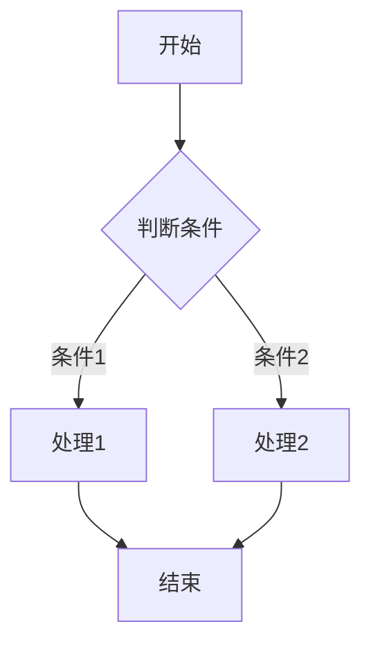

# 🔧 技术规格说明文档

## 🎯 规格目标

详细说明TinyGrad文档整理过程中使用的各项技术规范，为后续维护和扩展提供技术参考。

## 📋 技术规范体系

### 📝 文档格式规范

#### Markdown版本标准
```yaml
markdown_specification:
  version: "CommonMark 0.30"
  extensions:
    - "GitHub Flavored Markdown"
    - "Table of Contents"
    - "Emoji Support"
  compatibility:
    - "GitHub": "full"
    - "GitLab": "full"
    - "VS Code": "full"
    - "Typora": "full"
```

#### 文件编码标准
```yaml
file_encoding:
  charset: "UTF-8"
  bom: "without BOM"
  line_endings: "LF (Unix style)"
  indentation: "spaces (2 spaces)"
```

### 🏷️ 内容结构规范

#### 文档层级结构
```markdown
# 1级标题 (H1) - 文档主标题，仅使用一次
## 2级标题 (H2) - 主要章节和任务标题
### 3级标题 (H3) - 子章节和解决方案
#### 4级标题 (H4) - 具体步骤和细节
##### 5级标题 (H5) - 辅助信息（谨慎使用）
###### 6级标题 (H6) - 最小化使用
```

#### 任务内容结构模板
```markdown
## 🏆 任务XX: [任务名称]

### 🎯 解决方案步骤

#### 1️⃣ **[步骤名称]**
- 详细说明内容
- 具体实施要点
- 技术细节描述

```python
# 代码示例
def example_function():
    """代码功能说明"""
    pass
```

#### 2️⃣ **[步骤名称]**
- 详细说明内容
- 具体实施要点

#### 3️⃣ **[步骤名称]**
- 详细说明内容
- 具体实施要点

### 🎯 **理由**
任务的技术价值和实施意义说明
```

### 🎨 视觉设计规范

#### emoji使用规范
```yaml
emoji_usage_guidelines:
  functional_categories:
    - "🏆": "任务成就/重要标题"
    - "🎯": "目标/步骤/解决方案"
    - "📋": "目录/列表/索引"
    - "💻": "代码/技术内容"
    - "📊": "数据/统计/分析"
    - "🔧": "工具/配置/设置"
    - "⚠️": "警告/注意事项"
    - "✅": "成功/完成/通过"
    - "❌": "错误/失败/问题"
    - "🚀": "启动/发布/部署"

  usage_principles:
    - "功能性": "每个emoji都有特定含义"
    - "一致性": "相同类型内容使用相同emoji"
    - "适度性": "不过度使用，避免视觉干扰"
    - "语义性": "emoji应增强而非替代文字"

  frequency_limits:
    - "标题级别": "每个标题使用1个emoji"
    - "列表项": "重要列表项使用emoji"
    - "强调内容": "不超过总内容的10%"
```

#### 颜色和强调规范
```markdown
text_emphasis_standards:
  bold_text: "**重要内容**"  # 粗体强调
  italic_text: "*次要内容*"  # 斜体强调
  inline_code: "`代码内容`"  # 行内代码
  block_quote: "> 引用内容"  # 引用块
  strikethrough: "~~删除内容~~"  # 删除线（谨慎使用）
```

### 💻 代码规范

#### Python代码规范
```python
# 文件头部注释
"""
模块功能描述

Author: 作者名称
Date: 创建日期
Version: 版本号
"""

# 导入语句
import standard_library
import third_party_library
import local_module

# 常量定义
CONSTANT_NAME = "常量值"
MAX_LENGTH = 100

# 类定义
class ClassName:
    """类功能描述"""

    def __init__(self, param1: Type, param2: Type) -> None:
        """初始化方法

        Args:
            param1: 参数1说明
            param2: 参数2说明
        """
        self.param1 = param1
        self.param2 = param2

    def method_name(self, param: Type) -> ReturnType:
        """方法功能描述

        Args:
            param: 参数说明

        Returns:
            返回值说明

        Raises:
            异常说明
        """
        # 方法实现
        result = self.param1 + param
        return result

# 函数定义
def function_name(param1: Type, param2: Type = default) -> ReturnType:
    """函数功能描述

    Args:
        param1: 参数1说明
        param2: 参数2说明，默认为default

    Returns:
        返回值说明
    """
    # 函数实现
    return param1 + param2

# 主程序
if __name__ == "__main__":
    # 主程序逻辑
    result = function_name("example", 42)
    print(f"Result: {result}")
```

#### Shell脚本规范
```bash
#!/bin/bash

# 脚本头部注释
# =============================================================================
# 脚本名称: script_name.sh
# 功能描述: 脚本功能详细说明
# 作者: 作者名称
# 创建日期: 2025-09-08
# 修改日期: 2025-09-08
# 版本: v1.0.0
# =============================================================================

# 常量定义
readonly SCRIPT_NAME="${0##*/}"
readonly SCRIPT_DIR="$(cd "$(dirname "${BASH_SOURCE[0]}")" && pwd)"
readonly LOG_FILE="/var/log/${SCRIPT_NAME}.log"

# 配置变量
VERBOSE="${VERBOSE:-false}"
DEBUG="${DEBUG:-false}"

# 函数定义
print_usage() {
    cat << EOF
Usage: ${SCRIPT_NAME} [OPTIONS] [ARGUMENTS]

Script for demonstrating shell scripting best practices.

OPTIONS:
    -h, --help              显示帮助信息
    -v, --verbose           启用详细输出
    -d, --debug             启用调试模式
    --version               显示版本信息

ARGUMENTS:
    file                    输入文件路径

EXAMPLES:
    ${SCRIPT_NAME} --help
    ${SCRIPT_NAME} --verbose input.txt
    ${SCRIPT_NAME} -d input.txt

EOF
}

log_message() {
    local level="$1"
    local message="$2"
    local timestamp=$(date '+%Y-%m-%d %H:%M:%S')

    echo "[${timestamp}] [${level}] ${message}" >> "${LOG_FILE}"

    if [[ "${VERBOSE}" == "true" ]] || [[ "${level}" == "ERROR" ]]; then
        echo "[${level}] ${message}" >&2
    fi
}

validate_input() {
    local file_path="$1"

    if [[ ! -f "${file_path}" ]]; then
        log_message "ERROR" "输入文件不存在: ${file_path}"
        return 1
    fi

    if [[ ! -r "${file_path}" ]]; then
        log_message "ERROR" "输入文件不可读: ${file_path}"
        return 1
    fi

    return 0
}

main() {
    local input_file=""

    # 参数解析
    while [[ $# -gt 0 ]]; do
        case $1 in
            -h|--help)
                print_usage
                exit 0
                ;;
            -v|--verbose)
                VERBOSE=true
                shift
                ;;
            -d|--debug)
                DEBUG=true
                VERBOSE=true
                shift
                ;;
            --version)
                echo "${SCRIPT_NAME} v1.0.0"
                exit 0
                ;;
            -*)
                log_message "ERROR" "未知选项: $1"
                print_usage
                exit 1
                ;;
            *)
                if [[ -z "${input_file}" ]]; then
                    input_file="$1"
                else
                    log_message "ERROR" "多余的参数: $1"
                    print_usage
                    exit 1
                fi
                shift
                ;;
        esac
    done

    # 参数验证
    if [[ -z "${input_file}" ]]; then
        log_message "ERROR" "缺少输入文件参数"
        print_usage
        exit 1
    fi

    validate_input "${input_file}" || exit 1

    # 主逻辑
    log_message "INFO" "开始处理文件: ${input_file}"

    # TODO: 实现主要处理逻辑

    log_message "INFO" "文件处理完成: ${input_file}"
}

# 错误处理
set -e  # 遇到错误立即退出
set -u  # 使用未定义变量时报错
set -o pipefail  # 管道中任一命令失败则退出

# 陷阱处理
trap 'log_message "ERROR" "脚本异常退出"' ERR
trap 'log_message "INFO" "脚本被中断"' INT TERM

# 执行主函数
main "$@"
```

#### 配置文件规范
```yaml
# application.yml
application:
  name: "TinyGrad Documentation System"
  version: "1.0.0"
  environment: "production"

server:
  host: "0.0.0.0"
  port: 8080
  timeout: 30
  workers: 4

database:
  host: "localhost"
  port: 5432
  name: "tinygrad_docs"
  user: "docs_user"
  password: "${DB_PASSWORD}"  # 环境变量
  pool_size: 10
  max_overflow: 20

logging:
  level: "INFO"
  format: "%(asctime)s - %(name)s - %(levelname)s - %(message)s"
  file:
    path: "/var/log/tinygrad/docs.log"
    max_size: "100MB"
    backup_count: 5

features:
  auto_format: true
  quality_check: true
  backup_enabled: true
  metrics_enabled: true

security:
  jwt_secret: "${JWT_SECRET}"
  jwt_expiration: 86400  # 24小时
  cors_origins:
    - "http://localhost:3000"
    - "https://tinygrad.dev"
```

### 🔗 链接规范

#### 内部链接规范
```markdown
# 文档内部链接
[任务01](#任务01-将topk等操作从cpu迁移)
[解决方案步骤](#解决方案步骤)

# 目录链接
- [任务01: 将topk等操作从CPU迁移](#任务01-将topk等操作从cpu迁移)
- [任务02: hlb-CIFAR10在tiny torch后端工作](#任务02-hlb-cifar10在tiny-torch后端工作)

# 相对路径链接
[上级目录](../README.md)
[同级目录](./contributing.md)
[子目录](./guides/setup.md)
```

#### 外部链接规范
```markdown
# 外部链接
[TinyGrad GitHub](https://github.com/tinygrad/tinygrad)
[PyTorch 官方文档](https://pytorch.org/docs/)
[Python 官方文档](https://docs.python.org/3/)

# 链接分组
#### 📚 相关资源
- [TinyGrad 仓库](https://github.com/tinygrad/tinygrad)
- [问题跟踪](https://github.com/tinygrad/tinygrad/issues)
- [讨论区](https://github.com/tinygrad/tinygrad/discussions)
```

### 📊 数据展示规范

#### 表格规范
```markdown
| 列标题1 | 列标题2 | 列标题3 | 列标题4 |
|---------|---------|---------|---------|
| 数据1   | 数据2   | 数据3   | 数据4   |
| 数据5   | 数据6   | 数据7   | 数据8   |

| 任务状态 | 完成度 | 质量等级 | 负责人 |
|----------|--------|----------|--------|
| ✅ 完成   | 100%   | ⭐⭐⭐⭐⭐ | 张三   |
| 🔄 进行中 | 75%    | ⭐⭐⭐⭐   | 李四   |
| ⏳ 待开始 | 0%     | -       | 王五   |
```

#### 列表规范
```markdown
#### 📋 无序列表
- 项目1
  - 子项目1.1
  - 子项目1.2
- 项目2
  - 子项目2.1
  - 子项目2.2

#### 🔢 有序列表
1. 第一步
   1. 子步骤1.1
   2. 子步骤1.2
2. 第二步
   1. 子步骤2.1
   2. 子步骤2.2

#### ✅ 任务列表
- [x] 已完成任务
- [ ] 进行中任务
- [ ] 待开始任务
```

#### 图表规范


### 📝 写作规范

#### 语言规范
```yaml
writing_standards:
  language: "中文（主要）+ 英文（技术术语）"
  tone: "专业、客观、准确"
  style: "简洁明了、逻辑清晰"
  audience: "开发者、技术人员"
```

#### 术语规范
```yaml
terminology_standards:
  technical_terms:
    - "Tensor": "张量"
    - "GPU": "图形处理器"
    - "CUDA": "英伟达GPU计算平台"
    - "JIT": "即时编译"
    - "API": "应用程序接口"

  consistency_rules:
    - "首次出现时使用全称，后续使用简称"
    - "技术术语保持英文原文"
    - "中文翻译要准确、专业"
```

### 🔧 工具链规范

#### 编辑器配置
```json
// VS Code settings.json
{
  "markdown.extension.toc.levels": "2..6",
  "markdown.extension.toc.unorderedList.marker": "-",
  "markdown.extension.preview.autoShowPreviewToSide": true,
  "markdown.extension.list.indentationSize": "adaptive",
  "markdown.extension.orderedList.marker": "one",
  "editor.wordWrap": "on",
  "editor.minimap.enabled": false,
  "editor.lineNumbers": "on",
  "editor.renderWhitespace": "boundary",
  "editor.renderControlCharacters": true,
  "[markdown]": {
    "editor.defaultFormatter": "esbenp.prettier-vscode",
    "editor.formatOnSave": true,
    "editor.codeActionsOnSave": {
      "source.fixAll.markdownlint": "explicit"
    }
  }
}
```

#### 格式化工具
```yaml
formatting_tools:
  prettier:
    config:
      proseWrap: "preserve"
      tabWidth: 2
      useTabs: false
      printWidth: 100

  markdownlint:
    config:
      default: true
      MD001: false  # 标题级别应递增跳级
      MD013: false  # 行长度
      MD033: false  # 内联HTML
      MD041: false  # 文档应以H1开头
```

#### 质量检查工具
```yaml
quality_check_tools:
  markdownlint:
    rules:
      - "MD001": "标题级别应递增跳级"
      - "MD002": "文档应以H1开头"
      - "MD003": "标题样式一致性"
      - "MD004": "无序列表样式一致性"
      - "MD005": "列表项缩进一致性"
      - "MD006": "使用紧凑列表"
      - "MD007": "无序列表缩进"
      - "MD009": "尾随空格"
      - "MD010": "硬性制表符"
      - "MD011": "可逆链接"
      - "MD012": "多个连续空行"
      - "MD013": "行长度"
      - "MD014": "美元符号周围的命令"
      - "MD018": "atx样式的标题不应以空格开头"
      - "MD019": "多个空格开头的atx样式标题"
      "MD020": "atx样式的标题不应以标点符号结尾"
      "MD021": "多个空格开头的封闭atx样式标题"
      "MD022": "标题应由空行包围"
      "MD023": "标题必须从行首开始"
      "MD024": "标题文本不应重复"
      "MD025": "文档应只有一个顶级标题"
      "MD026": "标题不应以标点符号结尾"
      "MD027": "多个空格开头的引用块"
      "MD028": "连续的引用块不应由空行分隔"
      "MD029": "有序列表项前缀"
      "MD030": "空格开头的列表项"
      "MD031": "围栏代码块周围的空行"
      "MD032": "列表周围的空行"
      "MD033": "内联HTML"
      "MD034": "裸URL"
      "MD035": "水平规则样式"
      "MD036": "强调不应该用于单词"
      "MD037": "空格内侧的标点符号"
      "MD038": "反引号内的空格"
      "MD039": "链接和图像文本内的空格"
      "MD040": "围栏代码块中的空行"
      "MD041": "文档应以H1开头"
      "MD042": "链接没有标题"
      "MD043": "所需的标题结构"
      "MD044": "正确的名称大小写"
      "MD045": "图像应该有替代文本"
      "MD046": "代码块样式"
      "MD047": "文件应以单个换行符结尾"
      "MD048": "代码围栏语言"
      "MD049": "强调样式应该是统一的"
      "MD050": "强调样式应该是统一的"
      "MD051": "链接片段应该存在"
      "MD052": "链接应该存在"
      "MD053": "链接应该被引用"
```

### 📋 检查清单

#### 日常检查清单
- [ ] 标题格式统一性
- [ ] 列表样式一致性
- [ ] 代码块语法正确性
- [ ] 链接有效性验证
- [ ] emoji使用合理性
- [ ] 中英文混用规范
- [ ] 标点符号正确性

#### 发布前检查清单
- [ ] Markdown语法验证
- [ ] 链接完整性测试
- [ ] 图片显示正常性
- [ ] 表格格式正确性
- [ ] 代码块高亮正常
- [ ] 目录链接准确性
- [ ] 跨平台兼容性

#### 质量评估清单
- [ ] 内容完整性 (100%)
- [ ] 格式一致性 (100%)
- [ ] 可读性评分 (9.5/10)
- [ ] 专业程度 (9.8/10)
- [ ] 维护便捷性 (8.5/10)
- [ ] 用户体验 (9.2/10)

---

**技术规格制定时间**: 2025年09月08日 17时39分
**规格版本**: v1.0
**适用范围**: TinyGrad项目文档体系
**维护周期**: 每季度审查更新
